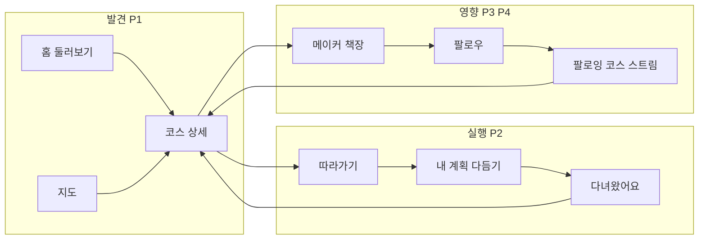
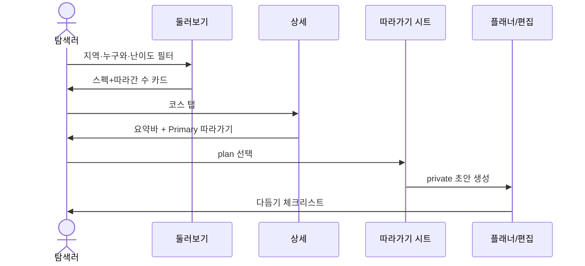
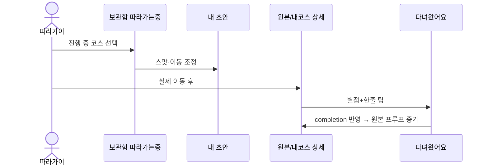
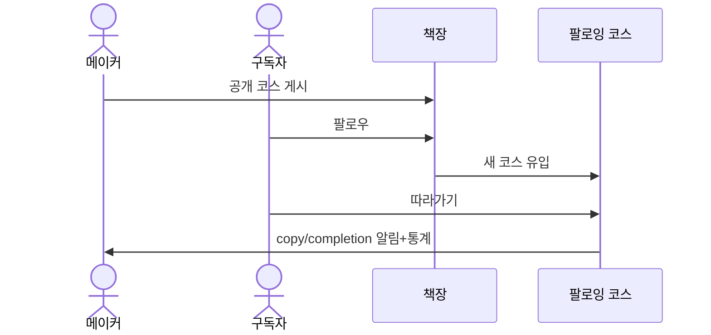

# 코스 UX 적용 설계

> **포지션:** 따라갈 수 있는 이동 코스 커뮤니티  
> **북스타 루프:** 발견 → 따라가기 → 다녀왔어요 → 영향력(복제·완주·팔로우)  
> **기준 코드:** course-sns MVP (`v0.1.0-mvp`, routdiary fork)  
> **관련:** 페르소나 P1 탐색러 · P2 따라가이 · P3 코스 메이커 · P4 영향력 구독자

이 문서는 “무엇을 만들지”가 아니라 **어디에·어떤 순서로·어떤 멘탈모델로 심을지**를 고정한다.  
구현 시 이 문서의 Phase·화면 스펙을 벗어나지 않는 것을 기본으로 한다.

---

## 0. 설계 원칙

1. **전이(transfer)가 1순위 가치.** 좋아요·감정은 보조 신호.
2. **화면마다 주인공 페르소나 하나.** 한 화면에 일기·쇼핑·구독을 동시에 풀지 않는다.
3. **기존 루프 자산 재사용.** `따라가기` / `다녀왔어요` / `copy_count` / `completion_*` / `recommended_for` / `difficulty`는 이미 있다. 없는 기능을 만들기 전에 **노출·언어·IA**를 먼저 맞춘다.
4. **루트다이어리 잔상 제거는 카피·IA부터.** DB rename(`routes`→`courses`)은 후순위(MVP-SETUP “나중에”).
5. **카드·상세의 1초 테스트.** 제목만 가려도 “따라갈 동선인지” 알 수 있어야 한다.

### 제품 언어 교체표 (전역)

| 지금 (잔상) | 코스 (목표) |
|-------------|-------------|
| 내 일기 | 내 코스 |
| 루트 / 루트일기 | 코스 / 코스 기록 |
| 둘러보기 (감성 피드) | 둘러보기 (코스 쇼핑) |
| 인기 = 좋아요 중심 | 인기 = 따라가기·다녀왔어요 중심(또는 병기) |
| 감정·테마 1순위 필터 | 지역·누구와·난이도·이동 1순위 |
| 저장/좋아요가 보관함 주연 | 따라간 코스·팔로잉 코스가 주연 |

---

## 1. IA 재배치

### 1.1 하단 탭 (유지 + 의미 재정의)

| 탭 | URL | 주인공 | 역할 재정의 |
|----|-----|--------|-------------|
| 홈 | `/` | P1 | **코스 쇼핑** — 공개 코스 발견 |
| 지도 | `/?mode=map` | P1 | **동선으로 고르기** — 위치·경로 감각 |
| 보관함 | `/library` | P2·P4 | **내 실행함 + 구독** — 따라간/저장한 코스, 팔로잉 코스 스트림 |
| FAB(+) | sheet → `/routes/new` | P3 | **코스 만들기** — “남이 따라갈 동선” |

프로필 칩 드로어(`/feed` 계열): **「내 코스」** (기록·계획 목록). 일기장 톤 제거.

### 1.2 보관함 세그먼트 재설계

**현재:** `저장 | 좋아요 | 팔로잉(사람)`  
**목표:**

| 세그먼트 | 내용 | 페르소나 |
|----------|------|----------|
| 따라가는 중 | `route_copies`로 가져온 내 초안·계획·진행 중 | P2 |
| 저장 | 북마크한 남의 코스(아직 안 따라감) | P1→P2 |
| 팔로잉 | **(A) 새 코스 스트림** + **(B) 사람 관리** 서브 | P4 |

- `좋아요`는 보관함 주 세그먼트에서 내리거나, 저장 안으로 흡수(2차).
- 팔로잉 기본 랜딩은 **사람 목록이 아니라 새 코스 피드**.

### 1.3 정보 구조 한 장

---

## 2. 화면별 적용 스펙

### 2.1 홈 · 둘러보기 (`FeedExplorer` / `FeedRouteCard` / `FeedControls`)

**목표:** P1이 1초 안에 “실행 가능한 코스”로 인식.

#### 카드 정보 계층 (모든 layout 공통)

1. **실행 스펙 한 줄** (신규 강조)  
   `시간 · 거리 · 이동수단 · 난이도`  
   데이터: legs 집계 duration/distance, transit 요약, `difficulty`  
   (상세의 `summarizeTransit` / plan duration 로직과 동일 소스 재사용)
2. **추천 대상** 칩 1개 (`recommendedFor` 첫 값)
3. **전이 소셜프루프**  
   `N명 따라감` · `M명 다녀옴` (`copyCount` / `completionCount`)  
   좋아요는 작게 또는 large 레이아웃에서만 보조
4. 제목 · 지역 · 작성자

**제거/축소:** 카드에서 mood 이모지·감성 카피 우선 노출.

#### 정렬 (`FeedControls` + `lib/data` sort)

| 키 | 라벨 | 정의 |
|----|------|------|
| `recent` | 최신 | 유지 |
| `followed` | 많이 따라간 | `copy_count` desc (신규 또는 popular 재정의) |
| `completed` | 많이 다녀온 | `completion_count` desc (신규) |
| `distance` | 가까운 | 유지 |
| `popular` | (과도기) | 좋아요 → 단계적으로 `followed`에 양보. 당분간 병기 가능 |

#### 필터 (`feed-filters` / `FeedFilterSheet`)

**1열(항상 위):** 지역 → 누구와(`purposes`) → 난이도  
**2열:** 테마 · 종류(기록/계획)  
**3열(접기):** 감정(mood) — 숨기거나 “더보기”

빈 결과 카피: “조건에 맞는 코스가 없어요. 지역만 바꿔 보세요.”

#### 헤더 카피

- 타이틀 유지 `둘러보기` 가능. 서브/빈상태만 코스 쇼핑 톤.  
- 프로필 칩 → 드로어 라벨 **내 코스** (`DiaryDrawerContent` 등 명칭·카피 일괄).

---

### 2.2 지도 (`FeedMap` + peek sheet)

**목표:** P1이 동선 밀도로 “갈 만한 코스”를 고름.

- 핀/클러스터 탭 → peek에 **스펙 한 줄 + 따라간 수** 후 상세.
- 선택 코스 오버레이(이미 있음) 유지 — “길이 보이는가”가 지도의 존재 이유.
- 필터는 리스트와 동일 소스(이미 session/URL 연동) — 지도에서도 purpose/difficulty 강조.

---

### 2.3 코스 상세 (`RouteView` / `CopyRouteButton` / Completions / Lineage)

**스크롤 스토리 (고정)**

1. 히어로(사진/지도)
2. 제목 + **전이 프루프** (따라감/다녀옴) — 이미 상단 근접
3. **Primary CTA: 이 코스 따라가기** (prominent 유지)
4. **코스 요약 바** (시간·거리·이동·난이도·스팟·비용) — 이미 있음, 히어로 직후로 위치 고정
5. 지도 동선 / 스팟 리스트 (실행 정보)
6. 다녀온 후기 · 따라간 사람들 (소셜 증명)
7. 여행 정보·감정·긴 메모 (하단, 참고용)
8. 작성자 카드 → 책장

**CTA 규칙**

| 상태 | Primary | Secondary |
|------|---------|-----------|
| 게스트/미복제 | 따라가기 | 저장·공유 |
| 복제함·미완주 | 다녀왔어요 | 내 초안 열기 |
| 완주함 | 후기 수정 | 공유 |
| 본인 글 | 수정/공유 | 영향력 수치 |

**따라가기 시트 (`CopyRouteButton`)**  
가이드 문장 유지하되, 완료 후 next-step을 명시하는 토스트/중간 화면:

> 가져왔어요. 스팟을 내 일정에 맞게 다듬어 보세요.  
> [계획 다듬기]

목적 선택(`plan` / `record`)은 유지 — P2 멘탈모델과 일치.

---

### 2.4 따라가기 이후 · 내 코스 / 플래너 (`RouteForm` plan draft)

**목표:** P2에게 “초안 편집 = 본업”.

1. 따라가기 성공 랜딩: 편집기 진입 시 **체크리스트 헤더** (1회성)
   - 스팟 확인 · 빼기/더하기 · 이동 확인 · (선택) 일정
2. 내 코스 드로어 탭: `전체 | 계획 | 기록` 유지하되 라벨을 코스 톤으로.  
   계획 카드에 상태 뱃지: `다듬는 중` / `다녀올 예정` / `다녀옴`(completion 연결 시).
3. 완주 유도: 복제본이 있고 completion 없으면 상세·알림에서 **다녀왔어요** 노출(이미 게이트 있음) + 카피 강화.

---

### 2.5 다녀왔어요 (`CompleteCourseButton` / CompletionsSection)

**목표:** 다음 P1을 위한 **짧은 전이 팁**, 일기 아님.

- 시트 카피: “별점과 한 줄 팁을 남기면 다음 사람의 선택에 도움이 돼요.”
- 상세 후기 리스트: 별점 · 한 줄 · 작성자 — 장문보다 스캔 우선.
- 알림 타입 `completion` 카피 유지·강조.

---

### 2.6 메이커 프로필 · 책장 (`/u/[handle]`, 통계)

**목표:** P3 — 프로필 = 코스 책장 + 영향력.

- 상단 통계 우선순위: **따라간 합 · 다녀온 합 · (평균 별점)** → 그다음 팔로워. 좋아요는 하위.
- 코스 그리드 카드: 홈과 동일한 스펙·전이 프루프.
- 본인 프로필/내 코스: “이번 달 N명이 내 코스를 따라갔어요” 한 줄(데이터 있으면).

**작성 FAB 진입 카피 (`BottomNav` sheet / `RouteForm`)**

- “기록하기” → **코스 만들기** / **계획 만들기**
- Step 카피: “제목과 테마·감정을 남기면 코스다워져요”  
  → **“누가 따라가기 쉽게, 동선·추천 대상·난이도를 먼저 채워요”**
- 공개 기본값 유지(course-first public) — 메이커 기본 가정과 맞음.

---

### 2.7 보관함 · 팔로잉 스트림 (`LibraryTabs` / `FollowingPanel`)

**목표:** P4 구독 + P2 실행함.

**Phase A (카피·구조 최소):**

- 세그먼트: `따라가는 중 | 저장 | 팔로잉`
- `따라가는 중` = 내가 copy한 코스 목록(신규 쿼리)
- 팔로잉: 상단 토글 `코스 | 사람` — 기본 `코스` = 팔로우한 유저의 최신 public 코스

**알림**

- 우선 노출: 팔로우한 사람의 새 코스(신규 타입이 없으면  interim으로 follow 대상 코스 알림 설계), completion, copy 관련.
- 좋아요·댓글은 유지하되 목록 시각 위계는 전이 알림 아래.

---

### 2.8 브랜드 레일 · 로그인 (`MobileFrame` BrandRail, login)

이미 코스 톤에 가깝다. 정렬만 강화:

- Pillar를 루프에 맞게: **발견 · 따라가기 · 다녀온 영향**
- “크리에이터를 팔로우” 유지 (P4)

---

## 3. 플로우별 상세 (핵심 3개)

### 3.1 P1 쇼핑 → 따라가기

### 3.2 P2 실행 → 완주

### 3.3 P3→P4 영향력

---

## 4. 컴포넌트 · 파일 매핑 (구현 체크리스트)

| 영역 | 주요 터치포인트 | 변경 성격 |
|------|-----------------|-----------|
| 카드 스펙·프루프 | `FeedRouteCard.tsx`, `RouteCard.tsx`, `CollectionCard.tsx` | UI + 집계 필드 노출 |
| 정렬 | `FeedControls.tsx`, `lib/data.ts` | sort 키 추가/재정의 |
| 필터 순서 | `FeedFilterSheet.tsx`, `feed-filters.ts` | IA·카피 |
| 상세 CTA/스토리 | `RouteView.tsx` | 섹션 순서·카피 |
| 따라가기 next-step | `CopyRouteButton.tsx`, `actions.ts` | UX 마이크로카피·리다이렉트 힌트 |
| 완주 | `CompleteCourseButton.tsx`, `RouteCompletionsSection.tsx` | 카피·스캔 UI |
| 내 코스 라벨 | `FeedExplorer.tsx`, `DiaryDrawerContent.tsx`, `feed/page.tsx` | 일기→코스 리네임 |
| 보관함 | `LibraryTabs.tsx`, `FollowingPanel.tsx`, `library/page.tsx`, `data.ts` | 세그먼트·쿼리 |
| 작성 | `RouteForm.tsx`, `BottomNav.tsx` FAB sheet | 카피·필드 강조 |
| 프로필 통계 | `u/[handle]`, profile stats | 지표 위계 |
| 브랜드 | `MobileFrame.tsx`, login | 카피 |
| persistence 키 | `routdiary:*` local/session keys | `course:*`로 이관(읽기 시 구키 폴백) |

---

## 5. Phase 계획 (난이도 기준, 일정 단위 없음)

### Phase 0 — 언어·위계만 (침습 최소, 포지션 즉시 노출)

- 전역 카피: 내 일기→내 코스, 루트→코스(사용자 노출면).
- 카드/상세에서 **copy/completion을 좋아요보다 위**.
- 필터 시트 순서: purpose·difficulty를 mood 위.
- 브랜드/작성/따라가기/완주 마이크로카피 코스 톤 통일.
- **성공 기준:** 신규 방문자가 홈만 보고 “따라가는 앱”으로 인식.

### Phase 1 — 발견·전환 강화 (P1 핵심)

- 카드 실행 스펙 한 줄(시간·거리·이동·난이도).
- 정렬: 많이 따라간 / 많이 다녀온.
- 상세 스크롤 스토리 고정 + 따라가기 후 next-step.
- **성공 기준:** 상세 진입→따라가기 CTR, 필터 사용률(지역·누구와).

### Phase 2 — 실행함·구독 (P2·P4)

- 보관함 `따라가는 중` + 팔로잉 **코스 스트림**.
- 계획 상태 뱃지·완주 유도.
- 알림 위계 조정(+ 가능 시 새 코스 알림).
- **성공 기준:** copy→completion 전환율, 팔로잉 스트림에서의 따라가기.

### Phase 3 — 메이커 영향력 (P3)

- 책장·본인 통계를 전이 지표 중심.
- 작성 마법사에서 동선·추천·난이도 필드 강조(필수에 가깝게).
- (선택) 메이커용 “이 코스가 잘 퍼짐” 하이라이트.
- **성공 기준:** 메이커당 public 코스 수, 코스당 copy_count.

### 명시적 Non-goals (이 설계 범위 밖)

- DB/URL `routes`→`courses` rename
- 루트다이어리와 코드 완전 분리(모노레포)
- 새 소셜 그래프(그룹·챌린지·랭킹 시즌) — Phase 3 이후 검토
- 감정(mood) 기능 삭제 — **노출 순위만 하락**

---

## 6. 측정 (CMO 북스타)

| 지표 | 정의 | 페르소나 |
|------|------|----------|
| Discovery→Detail | 카드 탭률 | P1 |
| Detail→Copy | 따라가기 CTR | P1→P2 |
| Copy→Completion | 복제 후 완주율 | P2 |
| Follow→Copy | 팔로잉 스트림/책장에서 복제 | P4 |
| Copies per public course | 코스당 평균 따라가기 | P3 |
| Completions per copy | 영향의 질 | P2·P3 |

가드레일: 좋아요·댓글은 관찰만. 북스타 대용으로 쓰지 않는다.

---

## 7. 구현 시 가드레일

1. **한 Phase씩 PR.** Phase 0만으로도 톤이 바뀌어야 한다.
2. **일기 드로어 애니메이션/스택 로직은 유지.** 라벨·카피·데이터 위계만 변경(HANDOFF의 slide 안정화 자산 보호).
3. **집계는 기존 컬럼 우선.** `copy_count` / `completion_count` / legs — 새 테이블 없이 Phase 0–1 가능.
4. **팔로잉 코스 스트림**만 신규 쿼리 성격이 큼 → Phase 2.
5. 디자인 시스템 토큰·카드 radius는 `DESIGN-SYSTEM.md` 준수. 코스 포지션 때문에 보라/다크/글로우 신규 테마를 만들지 않는다.

---

## 8. 다음 액션

1. Phase 0 PR: 카피·카드/필터 위계·브랜드 문장.
2. Phase 1: 스펙 한 줄 + sort 키 + 따라가기 next-step.
3. Phase 2 설계 상세(쿼리·보관함 IA)는 Phase 1 지표 본 뒤 스키마 확정.

이 문서가 course-sns와 routdiary의 **제품 무게 차이**를 UX 레벨에서 고정하는 기준이다.
