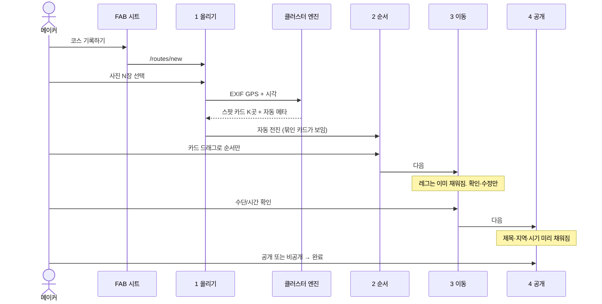

# Photo-first 코스 등록 — UX·구현 설계 (Wave G)

> **상태:** G0 설계 ✅ · G1–G4 기록 작성·수정 4화면 (`v0.4.1-mvp`)  
> **주인공:** P3 메이커 — “사진은 이미 코스다. 글은 선택이다.”  
> **관련:** [`COURSE-UX-DESIGN.md`](COURSE-UX-DESIGN.md) §2.6 · [`UX-PERSONA-PAINPOINTS.md`](UX-PERSONA-PAINPOINTS.md) P3-E · [`DESIGN-SYSTEM.md`](DESIGN-SYSTEM.md)  
> **범위:** 기록(record) 작성·수정·계획→기록 전환. 계획(plan) 지도 플래너는 **유지**하되 같은 카드/레그 언어로 맞춤.

이 문서는 “무엇을 만들지”와 **어디에·어떤 순서로·어떤 멘탈모델로 심을지**를 고정한다.  
구현 PR은 이 스펙을 벗어나지 않는 것을 기본으로 한다.

---

## 0. 한 줄

사진을 올리면 같은 위치는 스팟 카드로 묶이고, 카드 순서를 드래그하고, 그 사이에 이동만 확인하면 등록된다. 제목·본문은 쓰지 않아도 된다.

---

## 1. 멘탈모델 (10점의 출발점)

메이커가 들고 있는 것은 **폼이 아니라 그날의 사진 더미**다.

| 사용자 생각 | 제품이 해야 할 일 |
|-------------|-------------------|
| “여기 갔다” | 사진 GPS·촬영시각으로 스팟을 만든다 |
| “같은 곳 사진이 여러 장” | 한 스팟 카드로 묶는다 |
| “이 순서로 다녔다” | 시간순 기본 + 카드 드래그로 고친다 |
| “이렇게 이동했다” | 카드 **사이**에 수단·시간만 남긴다 |
| “글까지 쓰고 싶지 않다” | 제목·주소·지역·시기는 메타로 채우고, 본문은 생략 가능 |

**실패하는 멘탈모델 (현재):** “코스를 만들려면 스팟마다 이름·주소·지도·사진·일기를 채워야 한다.”  
이건 일기 앱의 잔상이다. 코스 앱의 1초 테스트는 **동선이 보이는가**이지, 문장이 있는가 가 아니다.

### 1.1 One screen, one task

한 화면에 주인공 액션은 하나. 빈 공간이 많아도 된다. 빈 공간은 버그가 아니라 **“지금은 이것만 하면 된다”는 신호**다.

| 화면 | 유일한 과제 | 하지 않는 것 |
|------|-------------|--------------|
| 1 올리기 | 사진을 고른다 | 제목, 스팟 편집, 공개 |
| 2 순서 | 스팟 카드 순서를 확인·드래그 | 본문 작성, 주소 입력, 이동 수정 |
| 3 이동 | 카드 사이 수단·시간을 확인 | 스팟 이름 고치기, 테마/감정 |
| 4 공개 | 공개/비공개를 고른다 | 새 필드 채우기 (이미 채워져 있음) |

이야기(테마·감정·비용·추천)는 4번 화면의 **접힌 옵션**이다. 필수 스텝이 아니다.

---

## 2. 현재 상태 (As-is) — 면밀 분석

작성의 진실원은 `src/components/RouteForm.tsx` 한 파일(~3,600줄)이다. create 위자드 · edit 스크롤 페이지 · plan 지도 플래너가 한 컴포넌트에 공존한다.

### 2.1 기록 위자드 (create, `intent=record`)

`STEP_LABELS = ["사진", "장소", "이동", "이야기", "공개"]` — 겉보기엔 이미 분리돼 있다. **실제 인지 부하는 2·4번에 몰려 있다.**

| 스텝 | 카피 | 실제 UI | 문제 |
|------|------|---------|------|
| 1 사진 | “그날의 사진을 올려주세요” | dashed 드롭존 + 분석 후 **전 사진 4열 그리드** | 묶음(스팟)이 안 보인다. 클러스터는 뒤에서만 일어남 |
| 2 장소 | “어느 지역 코스인가요?” | 지역 필드 + **스팟 카드 전부**(이름·주소·지도피커·사진·본문 textarea) + 스팟 추가 | one-task 붕괴. 일기 작성처럼 느껴짐 |
| 3 이동 | “어떻게 이동했나요?” | 스팟 쌍 리스트 + select/분/주의 | 방향은 맞음. 카드 **사이**가 아니라 별도 목록. 시간은 비어 있음(기본 도보, 추정 미적용) |
| 4 이야기 | “이 코스를 한마디로” | **제목 필수** + 추천/난이도 + 테마·감정·비용 접기 | 사진만으로 끝나야 하는데 제목이 게이트 |
| 5 공개 | “공개할지 골라 주세요” | 미리보기 카드 + FollowReadyHint + 공개 피커 | 게이트 자체는 유지할 가치 있음 |

저장 조건 (`canSave`): `title.trim() && region.trim() && spots.some(title)`.  
스팟 본문(`body`)은 필수가 아닌데, 카드에 textarea가 항상 열려 있어 **써야 할 것 같다**.

### 2.2 이미 있는 자산 (버리지 말 것)

| 자산 | 위치 | 재사용 |
|------|------|--------|
| EXIF GPS + 촬영시각 | `lib/exif.ts` `readPhotoGeo` | 그대로. 원본에서 읽고 압축은 저장 시 (`lib/image.ts`) |
| 시간순 + 120m 그리디 클러스터 | `RouteForm.buildFromPhotos` | `lib/photo-cluster.ts`로 추출 후 개선 |
| 역지오코딩 (장소명·시군구·주소) | `lib/naver.ts` `reverseGeocodeDetail` | 스팟 제목·지역 자동채움 |
| 지역 도출 | `deriveRegion` | 코스 `region` |
| 방문 시기 | `formatVisit` → `bestSeason` | “2026년 8월” |
| 스팟 DnD | `@dnd-kit` + `SortableSpot` | 카드 순서 화면의 핸들 |
| 스팟 내 사진 DnD | delay 180ms PointerSensor | 카드 탭 → 시트 안에서만 |
| 레그 시간 추정 | `estimateLegMinutes` (하버사인×수단 속도) | **기록 생성 시에도 즉시 채움** (지금은 플래너 전용) |
| 서명 URL 업로드 | `signPhotoUploads` | 저장 파이프라인 유지 |
| 공개 게이트 `visibilityChosen` | Wave D | 4번 화면에서 유지 |

### 2.3 클러스터링의 실제 동작 (함정 포함)

1. 선택 즉시 **모든 사진을 첫 스팟에 덤프** (피드백용).
2. EXIF를 동시성 4로 읽음.
3. GPS 있는 사진을 `takenAt` 정렬 후, 직전 클러스터와 **120m 미만이면 같은 스팟**.
4. GPS 없는 사진은 **촬영시각이 가장 가까운 클러스터에 강제 편입**. GPS가 하나도 없으면 첫 스팟에 쌓인 채 “다음 단계에서 장소를 지정” 노트.
5. 클러스터마다 reverse geocode → `title = place || area2 || area1`.
6. **코스 제목은 채우지 않음.** 지역·시기만.

결과: 사용자는 1번에서 “사진 그리드”만 보고, 2번에서 갑자기 여러 스팟+빈 일기칸을 만난다. 묶음의 마법이 안 보인다.

### 2.4 계획·수정은 다른 멘탈모델

| 모드 | 렌더 | 멘탈모델 | Wave G에서 |
|------|------|----------|------------|
| 기록 생성 `/routes/new` | 5스텝 위자드 | 사진 → 코스 | **전면 재배치** |
| 계획 생성 `?type=plan` | `PlanRoutePlanner` 지도 우선 | 아직 안 감, 핀을 꽂음 | 플래너 유지. 카드/레그 카피만 정렬 |
| 기록 수정 `/edit` | 4화면 위자드 (기본 2 순서) | 다듬기 | **구현됨 (G4)** |
| 계획 수정 (copy purpose=plan) | 지도 플래너 | 동선 다듬기 | 플래너 유지 |
| 따라가기 랜딩 `?followed=1` | 위 수정 분기 | 가져온 초안 | 기록 복제 → 2 순서 화면부터. 계획 복제 → 플래너 |
| 계획→기록 `ConvertPlanButton` | 상세에 남음 | 이제 다녀옴 | 전환 후 `/edit?photos=1`로 **올리기**부터 |

---

## 3. 등록 절차 진입점 — 전부 바꿀 수 있게 체크

구현 시 이 표의 행을 빠짐없이 건드린다. “FAB만 바꾸고 드로어 CTA는 옛 위자드”가 되면 멘탈모델이 깨진다.

### 3.1 생성 (기록)

| ID | 진입 | 파일 | 현재 | Wave G |
|----|------|------|------|--------|
| C1 | FAB + → 시트 “코스 기록하기” | `BottomNav.tsx` | `/routes/new` | 동일 URL. 시트 카피: “사진만 올리면 코스가 돼요” |
| C2 | 내 코스 빈 카드 “새 코스 만들기” | `HomeRoutesTabs.tsx` | `/routes/new` | 동일. 카드 카피 정렬 |
| C3 | 통계 empty CTA | `profile/stats/page.tsx` | `/routes/new` | 동일 |
| C4 | 게스트 FAB AuthGate | `BottomNav.tsx` | `next: /routes/new` | 동일. 설명 문장만 photo-first |
| C5 | 페이지 본체 | `routes/new/page.tsx` | `RouteForm mode=create` | 새 위자드 셸 |
| C6 | 로딩 셸 | `RouteFormLoadingShell.tsx` | 5칸 스텝 스켈레톤 | 4칸 + 큰 드롭존 스켈레톤 |
| C7 | 저장 액션 | `routes/new/actions.ts` | title 필수(클라) | 서버는 빈 title 허용 — 클라가 자동 제목 넣음. 스키마 변경 없음 |
| C8 | 보호 라우트 | `proxy.ts` | `/routes/new` | 변경 없음 |

### 3.2 생성 (계획) — 플래너 유지, 언어만

| ID | 진입 | 파일 | Wave G |
|----|------|------|--------|
| P1 | FAB “코스 계획하기” | `BottomNav.tsx` | URL 유지. 기록과 **의도 분기 명확** |
| P2 | 계획 탭 “새 코스 계획 만들기” | `HomeRoutesTabs.tsx` | 유지 |
| P3 | `?type=plan` | `routes/new/page.tsx` | `PlanRoutePlanner` 유지 |

### 3.3 수정·복제·전환

| ID | 진입 | 파일 | Wave G |
|----|------|------|--------|
| E1 | 상세 메뉴 → 수정 | `RouteMenu.tsx` | 기록: 4화면 위자드 (기본 2 순서). 계획: 플래너 |
| E2 | 따라가기 성공 | `routes/[id]/actions.ts` `copyRoute` | `?followed=1` 유지. 기록 복제 → 순서 화면 + “사진만 채우면 끝” |
| E3 | 상세 “내 초안” | `CourseFollowActions.tsx` | `/edit` — 위와 동일 셸 |
| E4 | 보관함 따라가는 중 카드 | `LibraryTabs.tsx` `editHref` | 동일 |
| E5 | 수정 페이지 | `routes/[id]/edit/page.tsx` | `RouteForm mode=edit` 입구는 유지, 내부 셸 교체 |
| E6 | 계획→기록 | `ConvertPlanButton.tsx` | 전환 후 사진 올리기 화면으로 보냄 (`?photos=1`) |
| E7 | 따라가기 시트 카피 | `CopyRouteButton.tsx` | “가져와서 사진만 얹으면 내 코스” 톤 (기록 목적) |

### 3.4 공유 UI·문서 (구현과 같이)

| ID | 파일 | 할 일 |
|----|------|-------|
| D1 | `COURSE-UX-DESIGN.md` §2.6 | 작성 스펙을 이 문서로 위임 (아래 패치) |
| D2 | `deliverables/screens` | `/routes/new` 비고: photo-first 4화면 |
| D3 | `deliverables/planning` | 만들기 시나리오 갱신 |
| D4 | `deliverables/status` | 기록 작성 = Wave G 설계됨 / 구현 대기 |
| D5 | `RouteFormLoadingShell` | 4스텝 |
| D6 | e2e | 생성 플로우는 스모크가 상세만 탐. 구현 PR에서 올리기 화면 셀렉터 가드 |

**명시적 비대상:** 피드 카드, 상세 뷰어, 라이트박스, Storage 버킷, DB 스키마 rename.

---

## 4. To-be 플로우

### 4.1 기록 생성 (북스타)



**완료까지 필수 탭:** 사진 선택 → (자동 분석) → 다음 → 다음 → 공개 탭 → 완료.  
글 입력 0회가 기본 경로다.

### 4.2 화면 전환 원칙

- 스텝 전환은 **가로 슬라이드** (iOS 멘탈모델). 내용이 바뀌어도 타임라인 골격(카드+사이 선)은 2↔3에서 공유해 “같은 코스를 보고 있다”는 연속성을 준다.
- 2번: 카드가 주인공, 사이 레그는 **읽기 전용 유령 칩** (예상 12분).
- 3번: 카드는 잠그고 축소, 사이 레그가 **커지고 편집 가능**.
- 1→2 자동 전진은 분석 완료 후. 사용자가 그리드를 해석할 틈을 주지 않는다 — **결과물은 카드**다.

### 4.3 예외 경로

| 상황 | 동작 |
|------|------|
| 사진 0장 | 1번 CTA 보조: “장소부터 찾기” → 빈 스팟 1 + 검색 시트. 일기칸 없음 |
| GPS 0장 | 1→2로 가되 카드는 “위치 없음” 트레이. 카드를 탭해 지도에서 한 곳만 찍으면 그 묶음이 스팟이 됨 |
| GPS 일부 | 위치 있는 사진은 스팟 카드. 없는 사진은 하단 **미분류 트레이** — 카드로 드래그해 편입 (시간 근접 자동 제안) |
| 스팟 1곳 | 3번 이동은 “이동할 다음 스팟이 없어요” 한 줄 + 다음 활성화 (레그 0) |
| 뒤로가기 | 1번에서 닫기 = 기존 나가기 확인 시트. 2–4는 스텝만 감소, 초안 유지 |

---

## 5. 화면별 UI 스펙 (10점)

공통 크롬: `MobileFrame shell` · `AppHeader closeButton` · 하단 1 CTA (`bg-sunset` rounded-xl, 플래너 레드 예산 준수) · 스텝퍼는 **점 4개** (라벨은 현재 스텝 제목에만). 숫자 뱃지는 `bg-ink` (sunset 점 P2-E 잔여 제거).

### 5.1 Screen 1 — 올리기

**과제:** 사진을 고른다.

```
┌─────────────────────────┐
│  ×        새 코스        │
│         · ○ ○ ○         │
│                         │
│                         │
│      ( 카메라 원 )       │
│   그날의 사진을          │
│      올려주세요          │
│                         │
│  위치가 있으면           │
│  같은 곳은 한 스팟으로   │
│                         │
│                         │
│  [ 사진 선택하기 ]       │
│  장소부터 찾기           │
└─────────────────────────┘
```

- 드롭존을 화면 중앙에 두고 **상하 여백을 크게**. dashed+sunset-wash는 유지하되 카드 높이를 키워 “이 화면의 유일한 버튼”처럼 보이게.
- 선택 후: 화면을 떠나지 않고 **분석 오버레이** — 필름스트립이 카드 더미로 합쳐지는 짧은 모션 (320ms, `prefers-reduced-motion`이면 스킵). 카피: “같은 위치끼리 묶는 중…”.
- 완료 즉시 2번으로. 1번에 4열 그리드를 **남기지 않는다** (그게 현재의 인지 단절).
- 보조 링크 “장소부터 찾기”는 `text-[13px] text-ink-soft`. 히어로가 아님.

### 5.2 Screen 2 — 순서 (카드)

**과제:** 이 순서가 맞는지 보고, 틀리면 드래그한다.

```
┌─────────────────────────┐
│  ×     이 순서로 다녔어요 │
│         ○ · ○ ○         │
│  강릉 · 8월 · 4곳        │
│                         │
│  ┌─ 1 세화 해변 ──────┐ │
│  │ [히어로 사진]  3장  │ │
│  │ 14:22 · 사진에서    │ │
│  └────────────────────┘ │
│           ┊ 도보 12분    │  ← 유령, 탭 불가
│  ┌─ 2 월정리 ─────────┐ │
│  │ [히어로]       5장  │ │
│  └────────────────────┘ │
│           ┊ 버스 25분    │
│  ┌─ 3 …                │
│                         │
│  [ 이 순서로 다음 ]      │
└─────────────────────────┘
```

**SpotTimelineCard**

- `rounded-[var(--radius-card)]` · `ring-1 ring-line/60` · 히어로 16:10 `object-cover`.
- 좌상단 번호 = `bg-ink text-paper` 원. 우상단 장수 칩.
- 장소명 = reverse geocode 결과, **input이 아님**. 16–17px font-black.
- 메타 한 줄: 첫 사진 시각 · “사진에서 묶음”.
- 드래그: 카드 좌측 핸들 (44pt) + 카드 롱프레스. 스크롤과 충돌 피하려고 핸들 우선, 롱프레스 delay 180ms는 사진 타일 패턴 재사용.
- 탭: 바텀시트 — 사진 그리드(내부 DnD·대표), 이름 수정(선택), 위치 미세조정(선택). **본문 textarea 없음.** “메모 추가”는 시트의 접힌 한 줄.
- 삭제: 시트 안, 또는 스와이프. 마지막 1장은 삭제 대신 “사진 더하기”.
- 미분류 트레이: 화면 하단 sticky 칩 스트립. 카드 위로 드롭.

이 화면에는 지역 텍스트 필드도, 스팟 추가 dashed 버튼도 **넣지 않는다**. 추가는 헤더 `+` → 사진 또는 장소 검색 시트.

### 5.3 Screen 3 — 이동

**과제:** 사이 이동이 맞는지 확인한다.

같은 타임라인이되 카드는 56px 압축 행(썸네일+이름), 사이 **LegConnector**가 주인공.

```
  1 세화 해변
  ┌─────────────────────┐
  │  도보  버스  지하철  │  ← ink 칩, active=bg-ink text-paper
  │  자가용 택시 …      │
  │  ⏱ 12분  (자동)     │  ← stepper − / + 5분
  └─────────────────────┘
  2 월정리
```

- 수단 칩: 브랜드 레드 쓰지 않음 (선택 = ink, DESIGN-SYSTEM §2.1 Selection).
- 시간은 EXIF 간격이 있으면 **실측**, 없으면 `estimateLegMinutes`. 배지 “자동”.
- 주의사항은 접기 (“주차·대기 메모”). 기본 경로에 없음.
- 스팟 2곳 미만: 빈 공간 + “한 곳만 있어도 코스가 돼요” + 다음.

### 5.4 Screen 4 — 공개

**과제:** 남에게 보일지 고른다.

- 미리보기 카드: 커버(첫 스팟 첫 사진) + **자동 제목** + 지역·시기·스팟 수·스펙 한 줄.
- 제목은 탭하면 인라인 편집. placeholder가 아니라 **이미 채워진 값**.
- 공개/비공개 큰 두 탭 (`VisibilityPicker` 유지, `visibilityChosen` 필수).
- FollowReadyHint는 추천/난이도가 비어도 “필수는 아니에요” 유지. 추천·난이도·테마는 **더 보기**.
- CTA: 완료. 임시저장은 헤더 텍스트 버튼 (계획과 패리티).

### 5.5 자동 제목 규칙

우선순위 (비어 있을 때만, 사용자가 고치면 덮지 않음):

1. `{shortRegion} {월} 코스` — 예: `강릉 8월 코스` (`shortRegionName` + EXIF 월)
2. `{첫 스팟} → {마지막 스팟}` — 지역이 여러 시/도일 때
3. `나의 코스` — 메타 전무 (GPS 0 + 장소 미지정)

서버는 빈 제목을 거절하지 않게 클라에서 항상 1–3을 넣어 보낸다.

### 5.6 모션·접근성

| 패턴 | 스펙 |
|------|------|
| 1→2 카드 등장 | 320ms decelerate, stagger 40ms |
| 2↔3 레이아웃 | 같은 리스트 `layout` 전환. 카드 높이만 줄임 |
| DnD | `@dnd-kit` 기존. 키보드 센서 유지 |
| 터치 | 핸들·CTA 44pt |
| Reduced motion | 분석 오버레이는 스피너만 |
| 에러 | `bg-error-soft text-error` (sunset-wash 금지) |

---

## 6. 메타데이터 자동채움 매트릭스

“수집 가능한 메타로 모든 항목값을 채운다”의 정본. 추측이 위험한 값은 비우고 4번에서 선택.

| 필드 | 소스 | 기록 생성 | 사용자가 안 건드리면 |
|------|------|-----------|----------------------|
| 스팟 lat/lng | EXIF GPS 클러스터 중심 (또는 첫 점) | ✅ | 저장 |
| 스팟 title | reverse geocode `place` → `area2` → `area1` | ✅ | 저장 |
| 스팟 address | reverse geocode road/jibun | ✅ | 저장 |
| 스팟 body | — | 빈 문자열 | 저장 (허용) |
| 스팟 사진 순서 | 촬영시각 | ✅ | 저장. 대표 = 코스 첫 사진 |
| 코스 region | `deriveRegion` | ✅ | 저장 |
| 코스 title | §5.5 | ✅ | 저장 |
| 코스 bestSeason | `formatVisit(min takenAt)` | ✅ | 저장 |
| 코스 cover | 첫 스팟 첫 사진 | ✅ | 저장 |
| leg.durationMin | 스팟 사이 EXIF 간격(분, 5분 단위) → 없으면 하버사인 추정 | ✅ 즉시 기입 | 저장 |
| leg.transport | 실측 속도: &lt;6km/h 도보, 6–15 자전거, 15–40 자가용, ≥40 기차/지하철 휴리스틱. 간격 없으면 거리 &lt;800m 도보, 아니면 자가용 | ✅ | 3번에서 수정 |
| leg.caution | — | 빈 값 | 저장 |
| recommendedFor | 추론 금지 | 빈 값 | 4번 선택 |
| difficulty | 총 도보 추정 ≥90분 → 어려움, ≥45 보통, 그 외 쉬움 (약함) | 채움 | 4번에서 수정 가능 |
| theme / mood / cost | 추론 금지 | 빈 값 | 접힌 옵션 |
| visibility | 기본 private, **명시 탭 필수** | 게이트 | 4번 |

EXIF 간격이 음수이거나 12시간을 넘으면 쓰레기값으로 보고 하버사인 추정으로 폴백.

---

## 7. 클러스터 엔진 (구현)

새 모듈 `src/lib/photo-cluster.ts` — `RouteForm.buildFromPhotos`에서 추출.

### 7.1 알고리즘 (방문 순서 보존)

기록 코스는 **시간순 이야기**다. 최근접 이웃으로 동선을 다시 짜지 않는다 (`optimizeByNearestNeighbor`는 계획 플래너 전용).

1. 각 파일 `readPhotoGeo` (기존 타임아웃 4s, 동시성 4).
2. GPS 있는 항목을 `takenAt` 오름차순.
3. 그리디: 직전 클러스터 중심과 `CLUSTER_RADIUS_M = 150` (현 120에서 소폭 확대 — 같은 해변/시장 왕복 컷). 중심은 추가될 때마다 평균 갱신.
4. GPS 없는 항목은 **자동 편입하지 않음** → `unlocated[]`. UI 트레이.
5. 클러스터마다 `reverseGeocodeDetail`.
6. 스팟 순서 = 클러스터 첫 사진 시각.

### 7.2 레그 채움

`src/lib/legs.ts`로 `estimateLegMinutes` / 속도 휴리스틱 이동. `buildFromPhotos` 성공 직후 `fillLegsFromMetadata(spots)` 호출 — 지금처럼 플래너 버튼에만 묶지 않는다.

### 7.3 성능

대량 HEIF는 이미 OOM 가드가 있다. 분석 중 1번 화면을 잠그고 (`bulkBusy`), 미리보기는 object URL을 클러스터 카드와 공유 (현 `draftFor` Map 유지).

---

## 8. 구현 단계 (코드 침습 순)

일정 단위 없음. **한 PR에 한 단계**를 기본으로 하되, G0는 이 문서다.

| 단계 | 무엇을 | 주요 파일 | 완료 조건 |
|------|--------|-----------|-----------|
| **G0** | 설계 정본 | 이 문서 + COURSE-UX 연결 | 진입점 표가 리뷰됨 |
| **G1** | 엔진 추출 + 자동 제목/레그 | `lib/photo-cluster.ts`, `lib/legs.ts`, `lib/course-title.ts` | 유닛 없이라도 순수 함수로 분리. RouteForm이 import만 |
| **G2** | SpotTimelineCard + LegConnector | `components/create/` | 스토리 없이 위자드 2·3에 장착 가능 |
| **G3** | 기록 생성 4화면 위자드 | `RouteForm` create 분기 교체, LoadingShell, BottomNav 카피 | ✅ 글 0회로 저장 가능. 공개 게이트 유지 |
| **G4** | 기록 수정 = 같은 4화면 | edit 스크롤/섹션점프 제거 | ✅ E1–E5 동일 셸 (`v0.4.1`) |
| **G5** | 따라가기·계획전환 랜딩 | Copy 카피, ConvertPlan `?photos=1`, followed 가이드 | ✅ 복제 후 사진/순서가 첫 과제 |
| **G6** | 계획 플래너 카피 패리티 | PlanRoutePlanner 레그 UI를 LegConnector에 가깝게 | 기록/계획 언어 일치. 지도 우선은 유지 |

G3가 사용자에게 보이는 핵심. G1 없이 G3 하지 말 것 (로직이 또 폼에 갇힘).

### 8.1 RouteForm 분해 가드레일

- 한 번에 3,600줄을 리라이트하지 않는다. create 분기를 `RecordCreateWizard`로 빼는 것이 G3.
- `handleSave` / 서명 업로드 / `visibilityChosen`는 공유 훅 `useRouteDraftSave`로 남긴다.
- 일기 드로어 스택·MobileFrame shell 규칙을 건드리지 않는다.
- 새 테마/글로우 금지. 카드는 §6.4 레시피.

### 8.2 저장 규칙 변경

```
canSave =
  autoTitle(title, spots, region, bestSeason)  // 항상 비지 않음
  && (region.trim() || spots.some(hasCoords) || spots.some(title))
  && spots.length >= 1
  && visibilityChosen   // finish만
```

스팟 제목이 비면 저장 직전 `스팟 n` 폴백. 본문 공백 허용.

---

## 9. 카피 정본 (사용자 노출)

| 위치 | 문장 |
|------|------|
| FAB 시트 기록 | 코스 기록하기 / 다녀온 사진을 올리면 동선이 만들어져요. |
| FAB 시트 계획 | 코스 계획하기 / 갈 곳을 지도에 모아 동선으로 짜요. |
| 1 제목 | 그날의 사진을 올려주세요 |
| 1 설명 | 같은 위치는 한 곳으로 묶어요. 글은 나중에 안 써도 돼요. |
| 1 CTA | 사진 선택하기 |
| 1 보조 | 장소부터 찾기 |
| 2 제목 | 이 순서로 다녔어요 |
| 2 설명 | 카드를 길게 눌러 순서를 바꿔 주세요. |
| 2 CTA | 이 순서로 다음 |
| 3 제목 | 사이 이동만 확인해요 |
| 3 설명 | 시간과 수단은 사진에서 채웠어요. 다르면 고쳐 주세요. |
| 3 CTA | 이동 맞아요 |
| 4 제목 | 공개할까요? |
| 4 설명 | 제목과 지역은 이미 채워져 있어요. |
| 4 CTA | 완료 |
| GPS 없음 | 위치가 없는 사진은 아래에 모아 두었어요. 카드로 끌어 주세요. |
| 따라가기 기록 초안 | 가져왔어요. 사진만 올리면 내 코스가 돼요. |
| 계획→기록 | 기록으로 바꿨어요. 다녀온 사진을 올려 주세요. |

---

## 10. 성공 기준 · 하지 말 것

### 성공 (P3 시나리오를 10점에 가깝게)

1. GPS 있는 사진 8장(3장소)을 올리면 **입력 없이** 스팟 3·레그 2·제목·지역이 채워진 4번 화면에 도달.
2. 1번 화면에서 과제는 “사진 선택” 외에 읽히지 않음 (필드 0).
3. 2번에서 본문/주소/지도가 기본 뷰에 없음.
4. 모든 진입점(C1–C3, E1–E6)이 같은 셸.
5. 공개 게이트·서명 업로드·EXIF→압축 순서는 회귀 없음.

### 하지 말 것

- 스팟 카드에 기본으로 textarea·주소 필드·지도 피커를 다시 펼치기
- 기록 코스를 최근접 이웃으로 재정렬하기
- GPS 없는 사진을 첫 스팟에 몰래 넣기
- 제목 없는 저장을 막기
- 이야기(테마/감정)를 다시 필수 스텝으로 올리기
- 계획 플래너를 사진 위자드로 대체하기 (아직 안 간 사람의 멘탈모델)
- 브랜드 레드를 수단 칩 active에 쓰기

---

## 11. 채점 루브릭 (구현 후 재채점)

P3 시나리오를 이 플로우로 다시 돈다. 목표 종합 **≥ 8.5** (현 7.6, 병목은 P3-E 5스텝+글 부담).

| 축 | 목표 | 근거 |
|----|-----:|------|
| 발견(도구) | 8.5 | 올리기 한 방이 도구의 입구 |
| 전이 명확성 | 8.5 | 카드 사이 레그 = 따라갈 동선 |
| 신뢰·안전 | 8.5 | 공개 게이트 유지, 자동값은 수정 가능 |
| 북스타 | 8.0 | 게시 마찰↓ → public 코스 수↑ |

---

## 12. 다음 구현 PR

1. G1 엔진 추출 (동작 변화 최소, 테스트하기 쉬운 순수 함수).
2. G2 카드·레그 컴포넌트.
3. G3 기록 생성 위자드 교체 — 사용자에게 보이는 전환점.
