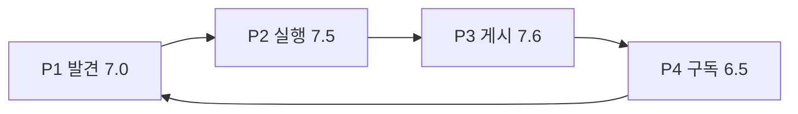

# 브랜드 컬러 · 페르소나 시나리오 재채점 (Wave A–D 이후)

> **범위:** course-sns MVP `v0.3.1-mvp` (코드 + DESIGN-SYSTEM · COURSE-UX)  
> **목적:** Waves A–D 이후 재채점 → **Wave E 구현**까지 반영한 정본  
> **기준일:** 2026-07-23  
> **상태:** §5 Wave A–D ✅ · §6 Wave E ✅ (E3는 `0014` DB push 필요)

---

## 0. 한 줄 요약

Wave E로 상세 전이 위계·콜드/지도 패리티·체크리스트 진정성·error≠brand·홈 팔로잉 레일·`copy`/`course_publish` 알림을 심었다.  
남은 후속은 **팔로잉 2단 IA 단순화(E6)** 와 **프로덕션에 `0014` 마이그레이션 적용**이다.

---

## 1. 채점 기준 (10점)

각 페르소나마다 시나리오를 끝까지 돌린 뒤 4축을 1–10으로 채점하고, **종합 = 산술 평균(소수 1자리)**.

| 축 | 의미 |
|----|------|
| **발견** | 목표 코스/다음 행동을 1–2탭 안에 찾을 수 있는가 |
| **전이 명확성** | “따라가기 → 다듬기 → 다녀왔어요”가 카피·색·IA로 읽히는가 |
| **신뢰·안전** | 공개 범위·에러·상태색·체크리스트를 믿을 수 있는가 |
| **북스타 루프** | 발견→복제→완주→영향력까지 끊기지 않는가 |

**10점짜리 시나리오** = 북스타에 필요한 화면·카피·분기를 빠짐없이 걷는 end-to-end (게스트 분기 포함).

---

## 2. Wave A–D · 게이트 적용 스냅샷

| 영역 | 현행 (증거) |
|------|-------------|
| 내비 | 보관함 = 스택 아이콘 · FAB `새 코스 만들기` |
| 피드 정렬 | `최신` · `많이 따라간` · `많이 다녀온` · `가까운` (`popular`→`followed`) |
| 카드/지도 | ♥ 폴백 제거 · peek `N 따라감`/`다녀옴` |
| 상세 CTA | 따라가기 solid · 다녀왔어요 outline · 후기 수정 neutral |
| 보관함 | `따라가는 중` + `FollowProgressBar` · 저장 카드「따라가기」 |
| AuthGate | 따라가기·완주·FAB·보관함 = 전이 가치 카피 |
| 토큰 | `--success` teal · walk slate · 플래너 완료만 sunset |
| 프로필/알림 | 따라감·다녀옴 우선 · 알림 `전이·구독` 그룹 |
| 게시 | `FollowReadyHint` + **공개/비공개 명시 선택**(`visibilityChosen`) |

---

## 3. 페르소나별 10점 시나리오 · 점수 · 페인포인트

### 3.1 P1 — 탐색러

**시나리오 (10점짜리)**  
홈 `둘러보기` → (선택) 필터 지역·누구와·난이도 → 정렬 `많이 따라간` → 카드 SpecLine+TransferPill → 상세 → `이 코스 따라가기` → (게스트) AuthGate → 목적 시트 → 비공개 초안 → `가져왔어요` 가이드.

| 축 | 점수 | 근거 |
|----|-----:|------|
| 발견 | **7.5** | 전이 정렬·필터 순서 양호. 툴바(정렬4+레이아웃3) 밀도·콜드 카드 약점 |
| 전이 명확성 | **7.0** | 따라가기 CTA·AuthGate 명확. 상세 상단 ♥/저장이 시선 분산 |
| 신뢰·안전 | **7.0** | 게스트 열람 OK. like/bookmark AuthGate는 일반 카피 |
| 북스타 루프 | **6.5** | 쇼핑→복제 입구는 열림. 콜드/지도 스펙 공백이 선택 확신 약화 |
| **종합** | **7.0** | |

**잔여 페인포인트**

| ID | 페인포인트 | 근거 |
|----|------------|------|
| P1-A | **콜드 소셜 슬롯 공백** — copy=0·completion=0·목적/난이도 없으면 TransferPill/MetaRow 숨김 | `FeedRouteCard` — “첫 따라가기 기회” 고정 슬롯 부재 |
| P1-B | **지도 peek에 SpecLine 없음** — 전이 수만, 시간·거리·난이도 부재 | `FeedMap` TourCard |
| P1-C | **상세 소셜 행이 전이 CTA 위** — ♥·저장이 `CourseFollowActions`보다 위 | `RouteView` — SNS 습관 잔상 (X2) |
| P1-D | **SpecLine null** — legs/difficulty 비면 한 줄 스펙 자체 소멸 | 1초 테스트 실패 |
| P1-E | **툴바 밀도** — 전이 정렬은 있어도 칩·토글이 많아 인지 비용 | `FeedControls` |

---

### 3.2 P2 — 따라가이

**시나리오 (10점짜리)**  
따라가기 → 플래너 `가져왔어요` → 보관함「따라가는 중」뱃지+진행바 → 원본 상세 `다녀왔어요`(outline) → 후기 시트 → CTA `후기 수정`(neutral) · 초안 재진입. (계획 소유 시 `기록으로 바꾸기`와 완주 구분)

| 축 | 점수 | 근거 |
|----|-----:|------|
| 발견(다음 행동) | **7.0** | 재진입 체크리스트·원본 링크 있음. 초안 vs 원본 후기 이중 경로 |
| 전이 명확성 | **8.0** | CTA 톤 사다리·뱃지 매핑 성공 |
| 신뢰·안전 | **7.5** | 완주 AuthGate 카피 좋음. 체크리스트 1스텝이 항상 ✓ |
| 북스타 루프 | **7.5** | 복제→완주 루프가 제품 중 가장 단단 |
| **종합** | **7.5** | |

**잔여 페인포인트**

| ID | 페인포인트 | 근거 |
|----|------------|------|
| P2-A | **`FollowProgressBar` 진정성** — `스팟 확인` 항상 done; `이동 확인`은 status≠tuning 수준 | `LibraryTabs` — 신뢰 훼손 |
| P2-B | **초안 다듬기 vs 원본 후기** — next-step이 원본으로 점프하기 쉬움 | 멘탈모델 이중화 |
| P2-C | **뱃지 오버레이** — 카드 아트 위 absolute 뱃지 | 터치·가독성 |
| P2-D | **저장 vs 따라가는 중 혼동** — 같은 `RouteCard` 베이스 + 저장에「따라가기」오버레이 | “이미 진행 중” 착각 |
| P2-E | **스팟 번호 등 잔여 sunset** — CTA 경쟁 소량 잔존 | `RouteForm` SpotDot |

---

### 3.3 P3 — 코스 메이커

**시나리오 (10점짜리)**  
FAB → 기록/계획 → (기록) 사진·장소·이동·이야기·공개 → `FollowReadyHint` → **비공개/공개 탭 필수** → 완료 → 프로필 드로어 `따라감·다녀옴` · 통계 `전이·영향력` · `/u/[handle]` 책장.

| 축 | 점수 | 근거 |
|----|-----:|------|
| 발견(도구·영향) | **7.0** | 드로어/통계에 전이 지표. 소유 상세에 영향력 히어로 약함 |
| 전이 명확성 | **8.0** | 준비도 힌트·추천/난이도 카피 명확 |
| 신뢰·안전 | **8.5** | 공개 게이트로 묵시 저장→상세 버그 해소 |
| 북스타 루프 | **7.0** | 게시→피전이까지. “누가 내 코스를 따라갔는지” 푸시 약함 |
| **종합** | **7.6** | |

**잔여 페인포인트**

| ID | 페인포인트 | 근거 |
|----|------------|------|
| P3-A | **`FollowReadyHint` soft-only** — 미완성도 공개 가능 | 품질 vs 마찰 트레이드오프 |
| P3-B | **통계 타이틀 `여행 통계`** — 코스 톤 잔상 | `profile/stats` |
| P3-C | **소유 상세에 영향력 부재** — 팔로워 액션 스킵 후 지표는 드로어/통계뿐 | 게시 직후 보상감 약 |
| P3-D | **에러 ≈ 브랜드 레드** — `--error`와 `--brand-primary` 동일 `#ef4444` | Wave C 잔여 (C1) |
| P3-E | **작성 5스텝 + 게이트** — 안전↑, 첫 메이커 완료 비용↑ | 드롭 리스크 |
| P3-F | **따라가기 수신 알림 없음** — completion/follow만, copy 수신 푸시 없음 | P3↔P4 피드백 구멍 |

---

### 3.4 P4 — 영향력 구독자

**시나리오 (10점짜리)**  
AuthorTap/작성자 카드 → `/u/[handle]` → `팔로우` → 보관함「팔로잉」`새 코스` → 상세 → `이 코스 따라가기`(P1→P2 재진입). 알림에서 완주/팔로 그룹 확인.

| 축 | 점수 | 근거 |
|----|-----:|------|
| 발견 | **5.5** | 스트림은 있으나 홈 레일·새 코스 알림 타입 없음 → 능동 배달 약 |
| 전이 명확성 | **7.0** | 팔로잉→상세→따라가기 연결은 명확. 2단 IA 비용 |
| 신뢰·안전 | **7.5** | 팔로우 상태 라벨 양호. Follow AuthGate 일반 카피 |
| 북스타 루프 | **6.0** | Follow→Copy가 제품에서 가장 약한 관절 |
| **종합** | **6.5** | |

**잔여 페인포인트**

| ID | 페인포인트 | 근거 |
|----|------------|------|
| P4-A | **새 코스 알림 타입 부재** — enum `like\|comment\|follow\|completion`만 | DB/알림 — 구독 루프가 보관함 의존 |
| P4-B | **홈에 팔로잉 메이커 레일 없음** | 발견이 AuthorTap 우연에 의존 |
| P4-C | **팔로잉 2단 IA** — `새 코스 \| 사람` | empty가 사람 탭으로 보냄 |
| P4-D | **사람 팔로우 AuthGate 일반 카피** | 구독 가치 프레이밍 부재 |
| P4-E | **저장「따라가기」가 진행 중처럼 보임** | P2-D와 교차 |

---

## 4. 스코어보드

| 페르소나 | 발견 | 전이 | 신뢰 | 북스타 | **종합** | Wave 전 대비(정성) |
|----------|-----:|-----:|-----:|-------:|---------:|-------------------|
| P1 탐색러 | 7.5 | 7.0 | 7.0 | 6.5 | **7.0** | ♥ 잔상↓ · 콜드/상세 경쟁 남음 |
| P2 따라가이 | 7.0 | 8.0 | 7.5 | 7.5 | **7.5** | CTA·재진입↑ · 체크리스트 진정성 |
| P3 메이커 | 7.0 | 8.0 | 8.5 | 7.0 | **7.6** | 공개 게이트·준비도↑ · 영향력 피드백 |
| P4 구독자 | 5.5 | 7.0 | 7.5 | 6.0 | **6.5** | 아이콘·알림 그룹↑ · **배달 루프 최약** |

**제품 종합(페르소나 평균): 7.2 / 10**

가장 약한 화살표: **P3→P4→P1** (영향력이 구독·재발견으로 안 돌아옴).

---

## 5. 교차 이슈 (잔여)

| ID | 이슈 | 상태 |
|----|------|------|
| X1 | HANDOFF §1 일기/그린 잔상 | ✅ §1 코스 IA로 재작성 (구 §3 로그는 이력) |
| X2 | 상세 좋아요가 북스타와 경쟁 | ✅ E1 — 전이 CTA 상단 |
| X3 | error ≈ brand 레드 | ✅ E5 — `#b91c1c` |
| X4 | 버전·작업로그 | ✅ `v0.3.1-mvp` + HANDOFF §7 |

---

## 6. UX 개선안 — Wave E (우선순위)

침습도·북스타 레버리지 순. 일정 단위 없음.

### E1 — 상세 전이 위계 (P1·P2, 침습 낮음) ✅

1. [x] `RouteView`: 따라가기/다녀왔어요를 ♥·저장보다 위 + 소유자 전이 프루프
2. [x] like/bookmark · FollowToggle AuthGate 전이 카피
3. 성공 기준: 상세 첫 스크롤 없이 주 CTA = 전이

### E2 — 콜드 발견·지도 패리티 (P1, 침습 낮음) ✅

1. [x] Transfer 슬롯 고정: `첫 따라가기`
2. [x] TourCard/`mapPointMeta` 스펙 패리티
3. [x] `courseSpecLine` — null 금지 (지역·스팟 폴백)
4. 성공 기준: 홈·지도 1초 테스트 동일

### E3 — P4 구독 배달 (P4·P3, 침습 중) ✅ 코드 / ⚠️ DB push

1. [x] 알림 타입 `course_publish` · `copy` (`0014_transfer_notifications.sql`)
2. [x] 홈 `FollowingRail`「팔로잉의 새 코스」
3. [x] 메이커: 따라가기 수신 알림(`copy`)
4. 성공 기준: Follow→Copy가 보관함 외 경로로도 성립 — **마이그레이션 적용 후**

### E4 — 진행 체크리스트 진정성 (P2, 침습 낮음~중) ✅

1. [x] `스팟 확인` / `이동 확인` 실데이터 조건
2. [x] 저장 카드 `저장함 · 아직 안 따라감`
3. 성공 기준: 체크리스트가 next-step 진실원

### E5 — 신뢰 토큰 마감 (P3·공통, 침습 낮음) ✅

1. [x] `--error` `#b91c1c` (brand와 분리)
2. [x] 통계 타이틀 `코스 통계`
3. 성공 기준: 에러 wash ≠ CTA wash

### E6 — 팔로잉 IA 단순화 (P4, 후속)

1. [ ] 서브칩 강등 검토 (E3 레일·알림으로 일부 완화)
2. [x] FollowToggle AuthGate 구독 가치 카피

---

## 7. 하지 말 것

- 브랜드를 그린/보라/크림-세리프 테마로 교체
- 좋아요·감정 **삭제**(위계만 조정)
- DB `routes`→`courses` rename을 UX 전제로 삼기
- 드로어 slide 스택 리라이트(HANDOFF 보호 자산)

---

## 8. 관련 정본

| 문서/코드 | 역할 |
|-----------|------|
| `docs/DESIGN-SYSTEM.md` | 컬러·컴포넌트 |
| `docs/COURSE-UX-DESIGN.md` | 페르소나·북스타·Phase |
| `docs/HANDOFF.md` §1·§7 | 현행 IA · 버전 로그 |
| `src/lib/version.ts` | `v0.3.1-mvp` |
| `src/app/routes/[id]/CourseFollowActions.tsx` | CTA 톤 |
| `src/app/(tabs)/library/LibraryTabs.tsx` | P2·P4 |
| `src/components/route/RouteForm.tsx` | 공개 게이트 · FollowReadyHint |

**다음 구현:** Wave **E1 → E2 → E4** (낮은 침습) 후 **E3**(구독 배달)를 별도 PR로.
