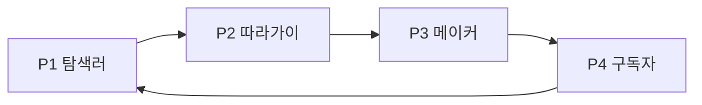

# 페르소나 요약 · 시나리오 · Playwright 시각 감사

> **범위:** course-sns 프로덕션 `https://course-sns.vercel.app` · `v0.3.3-mvp`  
> **방법:** Playwright Chromium 390×844 · 게스트 + 데모 계정(`demo@course-sns.app`) 읽기 전용 워크스루  
> **산출물:** `/opt/cursor/artifacts/persona-audit/*.png` · `e2e/persona-audit*.spec.ts` · `playwright.audit.config.ts`  
> **기준일:** 2026-07-27  
> **정본 페르소나:** [`COURSE-UX-DESIGN.md`](COURSE-UX-DESIGN.md)

---

## 0. 한 줄 요약

Wave E 이후 **전이 언어·CTA 위계·콜드「첫 따라가기」·AuthGate 카피**는 실측으로 확인됐다.  
지금 루프를 막는 것은 (1) **지도 베이스맵 공백**, (2) **데모/콜드 계정에서 P2·P4 실행함이 텅 비어 다음 행동이 안 보이는 것**, (3) **콘텐츠 신뢰(사진↔태그·스펙 불일치)**, (4) **통계/플래너에 남은 ‘여행·일기’ 멘탈모델 잔상**이다.

---

## 1. 페르소나 요약

| ID | 이름 | 한 줄 정의 | 성공 순간 | 주요 화면 |
|----|------|------------|-----------|-----------|
| **P1** | 탐색러 | 공개 코스를 **쇼핑**해 따라갈 동선을 고른다 | 카드/지도에서 1초 만에 “갈 만한 코스”로 확신 → 따라가기 | `/` · 지도 · 상세 · AuthGate |
| **P2** | 따라가이 | 복제한 초안을 **다듬고 다녀온다** | 보관함「따라가는 중」→ 다듬기 → `다녀왔어요` | 따라가기 시트 · 플래너 · 보관함 · 완주 |
| **P3** | 코스 메이커 | 남이 따라갈 **동선을 만들고 공개**한다 | FAB→작성→공개 게이트→책장/통계에 전이 지표 | FAB · `/routes/new` · 프로필 · `/u/[handle]` |
| **P4** | 영향력 구독자 | 메이커를 **구독**해 새 코스를 받아 따라간다 | 팔로우 → 새 코스 배달 → 따라가기(P1→P2) | 책장 · 팔로잉 · 알림 · 홈 레일 |

**북스타 루프:** 발견(P1) → 따라가기(P2) → 다녀왔어요 → 영향력(P3) → 구독 배달(P4) → 재발견(P1)


```mermaid
flowchart LR
  P1[P1 탐색러] --> P2[P2 따라가이]
  P2 --> P3[P3 메이커]
  P3 --> P4[P4 구독자]
  P4 --> P1
```

---

## 2. 페르소나별 10점 시나리오 (점검 스크립트)

채점 축: **발견 / 전이 명확성 / 신뢰·안전 / 북스타 루프** (각 1–10, 종합=평균).

### P1 — 탐색러

1. 게스트로 `/` 진입 → 정렬·필터·카드 SpecLine·TransferPill 확인  
2. 지도 탭 → 베이스맵·peek 스펙  
3. 카드 → 상세 → `이 코스 따라가기` → AuthGate  
4. 로그인 후 동일 코스 → 목적 시트(계획/기록)까지 (복제 실행은 읽기 전용으로 중지)

### P2 — 따라가이

1. 따라가기 시트 카피·목적 선택 게이팅  
2. 보관함「따라가는 중」진행 카드·체크리스트  
3. 초안 플래너 재진입 / 원본 `다녀왔어요` 톤  
4. *(데모 계정에 복제본 없으면 empty로 한계 기록)*

### P3 — 코스 메이커

1. FAB → 기록 5스텝 / 계획 지도 플래너 empty  
2. 소유 상세 영향력 빈 상태  
3. `/profile` 전이 지표 · `/profile/stats` 카피  
4. `/u/[handle]` 책장 + 팔로우 CTA

### P4 — 영향력 구독자

1. 메이커 책장 → `팔로우`  
2. 보관함「팔로잉」`새 코스` / `사람`  
3. 홈 팔로잉 레일 · `/notifications`  
4. *(팔로우 0이면 배달 루프 실측 불가 — empty 카피로 평가)*

**재현 명령**

```bash
AUDIT_BASE_URL=https://course-sns.vercel.app \
  pnpm exec playwright test --config=playwright.audit.config.ts
```

---

## 3. 실측 스냅샷 (2026-07-27)

| 증거 | 관찰 |
|------|------|
| `01-guest-home` | SpecLine·「첫 따라가기」노출 ✅. 정렬 칩 **잘림**(「많이…」). 그리드 카드 위 흰 텍스트 가독성 약 |
| `04-guest-map` | **베이스맵 타일 공백** — 핀만 떠 있음. 동선 쇼핑 멘탈모델 붕괴 |
| `05/07-detail` | 전이 CTA `이 코스 따라가기`가 ♥/저장 **위** ✅. AuthGate 전이 카피 ✅. 히어로 태그·무드 과밀. 스팟 갤러리 회색 슬롯 |
| `12-copy-sheet` | 계획/기록 목적 선택 + 비공개 초안 게이팅 ✅. 비활성 CTA가 연분홍으로 **클릭 가능해 보임** |
| `14-library-*` | 세그먼트 IA 명확. 데모는 **세 탭 모두 empty** → P2/P4 루프 실습 불가 |
| `15-팔로잉` | empty가 **사람 탭으로 유도** (2단 IA 비용 잔존) |
| `17-own-detail` | 「아직 따라간 사람이 없어요」영향력 힌트 ✅. 소유자 CTA 스택은 빈약 |
| `19-planner` | 지도 그리드 플레이스홀더·「여행 계획」카피 잔상. 첫 스팟 CTA는 명확 |
| `20-record-new` | 5스텝·사진 우선 명확. `다음`이 업로드 전에도 solid red |
| `21-profile` | 하드 `/profile` 네비 시 **빈 셸**로 찍힘(드로어/라우트 이슈). DOM 텍스트엔 설정·따라감/다녀옴 존재 |
| `22-stats` | 타이틀 `코스 통계` ✅. 본문 「함께한 여행」「여행 스타일」「내 여행 지도」잔상. 코스 1인데 거리/시간 0 |
| `23-u-pentanike` | 책장·전이 지표·팔로우 CTA 양호 |
| `24-notifications` | empty 카피에 새 코스·따라가기·완주 언급 ✅. 실알림 0 |

---

## 4. 페르소나별 페인포인트 (UX · UI · 멘탈모델)

### 4.1 P1 탐색러 — 종합 **6.4**

| 축 | 점수 | 근거 |
|----|-----:|------|
| 발견 | **5.5** | 카드 스펙은 있으나 **지도 타일 실패**로 동선 쇼핑 경로 붕괴 |
| 전이 명확성 | **7.5** | 따라가기 CTA·AuthGate·첫 따라가기 슬롯 양호 |
| 신뢰·안전 | **5.5** | 사진↔태그 불일치, 5분/250m/30만원, 히어로 가독성 |
| 북스타 | **7.0** | 게스트→로그인→시트 입구는 열림 |
| **종합** | **6.4** | |

| ID | 관점 | 페인포인트 | 증거 |
|----|------|------------|------|
| P1-U1 | UX | 지도에서 지리를 못 읽고 핀만 보임 → “어디 코스?” 판단 불가 | `04-guest-map` |
| P1-U2 | UX | 정렬/필터 칩이 뷰포트에서 잘려 전이 정렬(`많이 다녀온`)이 숨김 | `01`·`10` |
| P1-I1 | UI | 카드·히어로 위 흰 텍스트가 밝은 사진에서 뭉개짐 | `01`·`05` |
| P1-I2 | UI | 상세 A/B 토글 라벨만으로 의미 불명 (레이아웃 전환) | `05` |
| P1-I3 | UI | ♥0이 전이 CTA 바로 아래 — 위계는 맞지만 SNS 잔상 시선 분산 | `05` |
| P1-M1 | 멘탈 | 「해운대·카페·바다」카피 vs 위스키바 히어로 → 코스 신뢰 붕괴 | `05`·`23` |
| P1-M2 | 멘탈 | 스펙(5분·250m·가볍게)과 비용(30만원)이 한 화면에 충돌 | detail 텍스트 |
| P1-M3 | 멘탈 | 데스크톱 마케팅 레일 카피가 a11y 트리에 상시 섞임 → “앱인가 랜딩인가” | 전 화면 TEXT dump |

---

### 4.2 P2 따라가이 — 종합 **6.1**

| 축 | 점수 | 근거 |
|----|-----:|------|
| 발견(다음 행동) | **4.5** | 데모 보관함 empty — 복제 후 재진입 루프를 제품이 보여주지 못함 |
| 전이 명확성 | **8.0** | 시트 목적 분기·비공개 초안 카피 명확 |
| 신뢰·안전 | **6.5** | 비활성 CTA가 연분홍(브랜드 wash)으로 활성처럼 보임 |
| 북스타 | **5.5** | 입구는 좋으나 **실행함 데이터가 없어** 완주까지 못 밟음 |
| **종합** | **6.1** | |

| ID | 관점 | 페인포인트 | 증거 |
|----|------|------------|------|
| P2-U1 | UX | 「따라가는 중」이 비면 제품의 핵심 루프가 **존재하지 않는 것처럼** 보임 | `14` |
| P2-U2 | UX | 복제 실행을 스모크가 금지 → 시드/데모에 **샘플 따라가기 코스** 필요 | 계정 상태 |
| P2-I1 | UI | `내 비공개 초안 만들기` 비활성 색이 sunset-soft → 눌러도 될 것처럼 보임 | `12` |
| P2-M1 | 멘탈 | 계획 초안 vs 기록 작성 이중 경로 — 시트는 설명하나 이후 IA가 갈라짐 | `12` |
| P2-M2 | 멘탈 | 보관함 타이틀「보관함」이 실행함(할 일)보다 저장소로 읽힘 | `14` |

---

### 4.3 P3 코스 메이커 — 종합 **6.8**

| 축 | 점수 | 근거 |
|----|-----:|------|
| 발견(도구·영향) | **6.5** | FAB·5스텝·플래너 입구 명확. 소유 상세 보상 약 |
| 전이 명확성 | **7.5** | 책장·통계 전이 지표·빈 영향력 힌트 |
| 신뢰·안전 | **7.0** | 공개 게이트는 코드상 존재. 통계 수치 불일치(거리 0) |
| 북스타 | **6.0** | 게시→피전이 피드백(알림/수치)이 콜드에서 0 |
| **종합** | **6.8** | |

| ID | 관점 | 페인포인트 | 증거 |
|----|------|------------|------|
| P3-U1 | UX | 기록 작성 5스텝 + 사진 우선 — 첫 메이커 완료 비용 큼 | `20` |
| P3-U2 | UX | `/profile` 하드 진입 시 빈 화면처럼 보임(설정 드로어 전제) | `21` |
| P3-I1 | UI | 플래너 배경이 실제 지도가 아닌 그리드 스케치 — “지도 위 계획” 약속과 어긋남 | `19` |
| P3-I2 | UI | 통계 히트맵·누적이 거의 0인데 섹션 면적이 큼 → 허전함 | `22` |
| P3-M1 | 멘탈 | 통계 카피 「함께한 여행」「여행 스타일」「내 여행 지도」= 일기 잔상 | `22` TEXT |
| P3-M2 | 멘탈 | 플래너 「여행 계획」라벨 — 코스/동선 언어와 불일치 | `19` |
| P3-M3 | 멘탈 | 코스 1·스팟 1인데 이동거리/시간 0 — “기록이 안 된 건지 버그인지” | `22` |

---

### 4.4 P4 영향력 구독자 — 종합 **5.8**

| 축 | 점수 | 근거 |
|----|-----:|------|
| 발견 | **5.0** | 책장·팔로우는 있으나 **팔로잉 스트림·알림·홈 레일 실데이터 0** |
| 전이 명확성 | **6.5** | 팔로잉 2단(`새 코스`/`사람`). empty→사람 유도 |
| 신뢰·안전 | **7.0** | 팔로우 CTA·알림 empty 카피 양호 |
| 북스타 | **4.5** | Follow→Copy 관절이 콜드에서 **끊긴 채로 보임** |
| **종합** | **5.8** | |

| ID | 관점 | 페인포인트 | 증거 |
|----|------|------------|------|
| P4-U1 | UX | 팔로우 전에 팔로잉 탭이 비어 “구독 가치가 없는 제품”으로 읽힘 | `15-팔로잉` |
| P4-U2 | UX | empty가 사람 검색으로보냄 — 새 코스 배달이 1순위가 아님 | `15`·`16` |
| P4-U3 | UX | 홈「팔로잉의 새 코스」레일이 팔로우 0일 때 안 보여 **존재를 모름** | `10` |
| P4-I1 | UI | 보관함에 실행(P2)·저장·구독(P4)이 한 세그먼트에 공존 → 주인공 페르소나 흐림 | `14` |
| P4-M1 | 멘탈 | 「팔로잉」이 코스 스트림인지 사람 목록인지 탭을 열기 전엔 불명 | `14`–`16` |
| P4-M2 | 멘탈 | 알림 empty는 약속만 있고, `0014` 미적용 시 실제 배달과 어긋날 수 있음 | `24` · HANDOFF |

---

## 5. 스코어보드 (Playwright 재채점)

| 페르소나 | 발견 | 전이 | 신뢰 | 북스타 | **종합** | Wave E 문서 대비 |
|----------|-----:|-----:|-----:|-------:|---------:|------------------|
| P1 탐색러 | 5.5 | 7.5 | 5.5 | 7.0 | **6.4** | 지도·콘텐츠 신뢰로 하락 |
| P2 따라가이 | 4.5 | 8.0 | 6.5 | 5.5 | **6.1** | 실행함 empty로 하락 |
| P3 메이커 | 6.5 | 7.5 | 7.0 | 6.0 | **6.8** | 여행 잔상·통계 정합 |
| P4 구독자 | 5.0 | 6.5 | 7.0 | 4.5 | **5.8** | 배달 루프 여전히 최약 |

**제품 종합(평균): 6.3 / 10** (이전 문서 7.2 → **실측 후 하향**. Wave E UI는 심겼으나 **콜드/지도/시드 공백**이 체감 점수를 깎음)

가장 약한 화살표: **P3→P4→P1** (구독 배달) 및 **P1 지도 발견**.

---

## 6. 교차 이슈

| ID | 이슈 | 상태 |
|----|------|------|
| X1 | 네이버 지도 베이스맵 미표시(핀만) | 🔴 실측 — 키/도메인/헤드리스 재확인 |
| X2 | 데모 계정에 따라가기·팔로우 시드 없음 | 🔴 P2/P4 E2E·온보딩 데모 불가 |
| X3 | 콘텐츠 품질 가드 없음(사진·태그·스펙·비용) | 🟠 FollowReadyHint soft-only |
| X4 | ‘여행/일기’ 카피 잔상(통계·플래너) | 🟠 |
| X5 | MobileFrame 마케팅 레일이 a11y/텍스트에 혼입 | 🟡 |
| X6 | `0014` 알림 타입 프로덕션 적용 | ⚠️ HANDOFF 기존 주의 |
| X7 | 버전·작업로그 규칙 | ✅ `AGENTS.md` |

---

## 7. Wave F — 다음 개선 (침습도 순)

### F1 — 지도 베이스맵 복구 (P1, P0)

1. 프로덕션·프리뷰·localhost 도메인 등록 및 실기기 재확인  
2. 타일 실패 시 empty가 아니라 **명시적 에러/재시도**  
3. 성공: 지도 탭에서 도로·지명이 보이고 peek로 코스 선택 가능

### F2 — 데모/콜드 루프 시드 (P2·P4, 낮음)

1. 데모 계정에 **따라가는 중 1건 + 팔로우 1명 + 새 코스 1건** 시드  
2. 성공: 보관함·팔로잉이 empty 온보딩이 아닌 **실행 루프 쇼케이스**

### F3 — 구독 배달 가시성 (P4, 낮음~중)

1. 팔로잉 empty 기본을「사람」이 아니라 **추천 메이커/둘러보기**로  
2. 팔로우 0이어도 홈에 레일 자리(플레이스홀더)로 존재 학습  
3. `0014` 프로덕션 push 확인

### F4 — 신뢰·카피 마감 (P1·P3, 낮음)

1. 통계/플래너「여행」→「코스」언어 통일  
2. 비활성 CTA를 ink/muted disabled로 (브랜드 soft 금지)  
3. 카드 텍스트 대비(그라데이션/스크림) 강화  
4. FollowReadyHint에 스펙·커버 불일치 경고 검토

### F5 — 작성 마찰 (P3, 중)

1. 기록 5스텝 진행 중 스킵 가능 스텝 표시  
2. `/profile` 하드 네비 = 설정 풀페이지 보장

---

## 8. 하지 말 것

- 브랜드를 그린/보라/크림-세리프 테마로 교체  
- 좋아요·감정 **삭제**(위계만 조정)  
- DB `routes`→`courses` rename을 UX 전제로 삼기  
- 드로어 slide 스택 리라이트(HANDOFF 보호 자산)  
- 실DB 쓰기 E2E를 데모 계정에 상시 실행

---

## 9. 관련 정본

| 문서/코드 | 역할 |
|-----------|------|
| `docs/COURSE-UX-DESIGN.md` | 페르소나·북스타·Phase |
| `docs/DESIGN-SYSTEM.md` | 컬러·컴포넌트 |
| `docs/HANDOFF.md` §7 | 버전 로그 |
| `src/lib/version.ts` | `v0.3.3-mvp` |
| `e2e/persona-audit.spec.ts` · `persona-audit-part2.spec.ts` | 시각 감사 |
| `playwright.audit.config.ts` | 프로덕션 감사 설정 |
